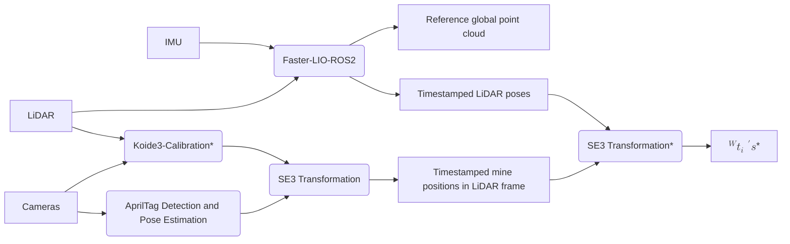
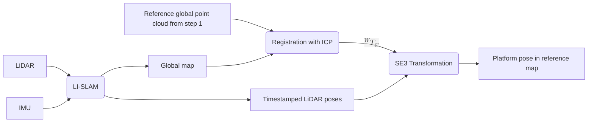
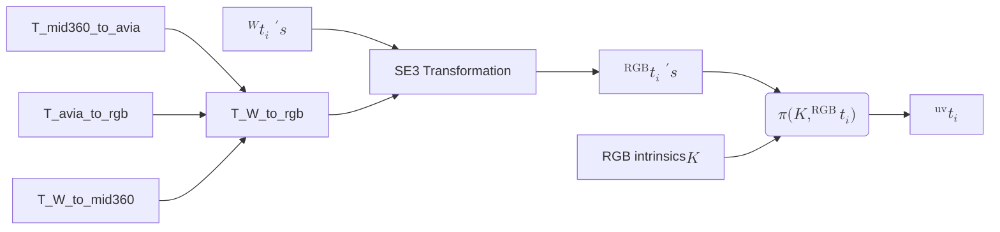

## 1. Create the reference map with mine locations

Using the platform sensors only:

where:
- $^W \mathbf{t}_i \in \mathbb{R}^3$ is the position of the i-th target in the world frame

Nodes marked with a * are not implemented yet. 

## 2. Compute the poses of the platform in the current sequence in the reference map

Using LiDAR-inertial data from the new sequence:

where:
- $^W T_C$ is the SE3 transformation from current map to world frame (i.e. reference map)

## 3. Project the target positions in the arm cameras

Here shown using the RGB camera as example:

where:
- $^{\textnormal{uv}} \bm t_i$ are the coordinates of the i-th target in the image plane of the RGB camera
- $\pi(\bm K, ^{\textnormal{RGB}} \bm t_i)$ is the pinhole camera projection operation
